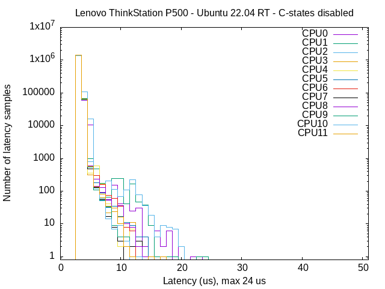
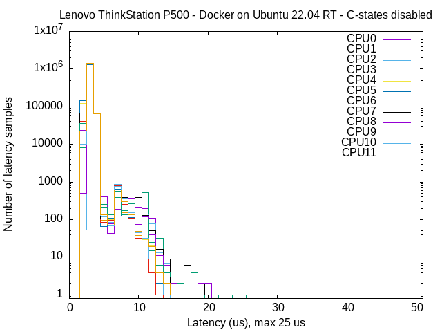

# Docker real-time guide for Ubuntu Realtime-Kernel or `PREEMPT_RT`

Author: [Tobit Flatscher](https://github.com/2b-t) (August 2021 - February 2023)

[](https://github.com/2b-t/docker-realtime/actions/workflows/run-tests.yml) [](https://opensource.org/licenses/MIT)


## Overview

This is guide explains how one can **develop inside/deploy a [Docker container](https://www.docker.com/) running real-time capable code on a Linux operating system**. As such it walks you through:

- **Basics of real-time systems** and an [*overview of different real-time Linux approaches*](./doc/RealTimeLinux.md)
- **Set-up** of a real-time system, in particular activating the [Ubuntu realtime-kernel](https://ubuntu.com/blog/real-time-ubuntu-is-now-generally-available) or alternatively the [*installation of `PREEMPT_RT`*](./doc/PreemptRt.md) supplying simple [*scripts for automatically re-compiling the kernel*](./src/compile_kernel_preemptrt)
- [Possible **optimizations**](./doc/RealTimeOptimizations.md) of a real-time system in order to minimise the latency and **benchmarking** the real-time performance by means of [`cyclictest`](https://wiki.linuxfoundation.org/realtime/documentation/howto/tools/cyclictest/start)
- Required settings for a **real-time capable container** with a **[`PREEMPT_RT`](https://wiki.linuxfoundation.org/realtime/start) patched host system**

This guide does not apply to Windows and Macintosh operating systems as it relies on a `PREEMPT_RT`-patched host system and Docker on Windows and Macintosh actually runs with a light-weight virtual machine in the middle.

For an **introduction into development with Docker** and Docker-Compose, how to set it up in Visual Studio Code and a guide for using it with graphic user interfaces and ROS workspaces have a look at my other repository [**`docker-for-ros`**](https://github.com/2b-t/docker-for-ros).

### Use-cases

This can be useful for several different applications, in particular:

- Controlling **real-time robotics hardware** from Linux systems, e.g. over EtherCAT (by using EtherCAT masters such as [SOEM](https://github.com/OpenEtherCATsociety/SOEM) or [IgH](https://etherlab.org/en/ethercat/)) or setting up containers for other robotic components such as the [Franka Emika Panda](https://www.franka.de/) collaborative robotic arm
- **Numerical control** by turning your desktop or single-board computer into a SoftPLC e.g. with [CodeSYS Control](https://www.codesys.com/products/codesys-runtime/control.html) or using [LinuxCNC](http://linuxcnc.org/)
- **Real-time programming in audio development** such as with [Juce](https://juce.com/discover/stories/real-time-programming-in-audio-development)

but may also apply to software developers developing any other form of real-time capable code.


## 1. Docker for real-time applications

There are different ways of turning a vanilla Linux system into a real-time capable operating system. As outlined in [`doc/RealTimeLinux.md`](./doc/RealTimeLinux.md) **[`PREEMPT_RT`](https://wiki.linuxfoundation.org/realtime/start)** is likely the most future-proof possibility as it is about to be included into the mainline of Linux. As of Ubuntu 22.04 it is also available to Ubuntu users out of the box with [Ubuntu Pro](https://ubuntu.com/pro).

As a Docker shares the host kernel allowing a container to run real-time capable code is just a matter of starting it with the right permissions as long as the host kernel is real-time capable. The set-up of a real-time capable Docker with the Ubuntu realtime-kernel/`PREEMPT_RT` is quite straight forward. All you need is:

- A Ubuntu operating system with [**realtime-kernel**](https://ubuntu.com/blog/real-time-ubuntu-is-now-generally-available) or alternatively **`PREEMPT_RT`-patched Linux host operating system**
- An arbitrary **Docker container** launched with the correct options so that it can set real-time priorities from inside the container as well as options for reducing the network latency

### 1.1 Installing the realtime-kernel

There are several ways of applying a [`PREEMPT_RT`](https://wiki.linuxfoundation.org/realtime/start) patch. [Since February 2023](https://ubuntu.com/blog/real-time-ubuntu-is-now-generally-available) and Ubuntu 22.04 an Ubuntu realtime-kernel, that can be installed with a few terminal commands, is available through [**Ubuntu Pro**](https://ubuntu.com/pro). For **personal use** you can **register up to five machines for free** while commercial customers will have to sign up for a [subscription](https://ubuntu.com/pro/subscribe). I recommend installing the patch in this way as it is by far the easiest and most reliable. The guide  [`doc/PreemptRt.md`](./doc//PreemptRt.md) walks you through the registration and installation procedure.

Alternatively, I have also lined out the installation procedure either by compilation from source or from an existing [Debian package](https://packages.debian.org/buster/linux-image-rt-amd64) in [`doc/PreemptRt.md`](./doc//PreemptRt.md). The same procedure can also be performed with the provided scripts [`src/install_debian_preemptrt`](./src/install_debian_preemptrt) and [`src/compile_kernel_preemptrt`](./src/compile_kernel_preemptrt).

### 1.2 Setting up real-time privileges

After having patched your system and restarted it, booting into the freshly installed kernel, you should already be good to go to launch a real-time capable Docker. In case you do not intend to use [`root` as the user inside the Docker](https://medium.com/jobteaser-dev-team/docker-user-best-practices-a8d2ca5205f4) you furthermore will have to have give yourself a name of a user that belongs to a group with **real-time privileges on your host computer**. How this can be done can be found in [`doc/PreemptRt.md`](./doc/PreemptRt.md).

### 1.3 Launching the Docker

**After having successfully installed `PREEMPT_RT`**, it is sufficient to execute the Docker [with the options](https://docs.docker.com/engine/reference/run/#runtime-privilege-and-linux-capabilities):

```yaml
    cap_add:
      - SYS_NICE
    ulimits:
      rtprio: 99
      rttime: -1 # corresponds to 'unlimited'
      memlock: 8428281856
    network_mode: host
```

Then **any process from inside the Docker can set real-time priorities `rtprio`** (e.g. by calling [`::pthread_setschedparam`](https://man7.org/linux/man-pages/man3/pthread_getschedparam.3.html) from inside the C/C++ code or by using [`chrt`](https://askubuntu.com/a/51285) from the command line). Generally it is advisable to [not set `rtprio` to 99](https://github.com/ros2-realtime-demo/pendulum/blob/rolling/docs/real_time_linux.md#setting-permissions-for-the-scheduler) (refer to [pull request #3](https://github.com/2b-t/docker-realtime/pull/3#issuecomment-1296926347) for more information).


## 2. Example

This Github repository comes with a simple example that can be used to try it out. Inside the Docker container a [`cyclictest`](https://wiki.linuxfoundation.org/realtime/documentation/howto/tools/cyclictest/start) is run to assess the real-time performance of the system. You can compare the outcome to running it on your local system. There should be virtually no difference between the two, as can be seen from the graphs below:

|  |  |
| ---------------------------------------------------------- | ------------------------------------------------------ |

For launching the `cyclictest` open the Docker by typing

```shell
$ docker-compose -f docker/docker-compose.yml up
```

then browse the folder `benchmark/` and run the command

```shell
$ ./mklatencyplot.bash
```

This should create a latency histogram by measuring the difference between a thread's intended wake-up time and its actual wake up time (resulting in an image `plot.png` similar to the one above). This measures any form of latency caused by hardware, firmware and operating system. For more information on this test refer to [OSADL](https://www.osadl.org/Create-a-latency-plot-from-cyclictest-hi.bash-script-for-latency-plot.0.html).
