# Ubuntu realtime-kernel/`PREEMPT_RT` set-up

Author: [Tobit Flatscher](https://github.com/2b-t) (August 2021 - February 2023)

## 1. Setting-up `PREEMPT_RT`

The set-up of `PREEMPT_RT` basically consists in **installing a new kernel** either from an existing **Debian package** that was compiled by somebody else for you (e.g. Ubuntu realtime-kernel), by creating a Debian package yourself by recompiling the kernel or installing it directly. After that you will have to perform a restart and booting into that freshly installed kernel as well as potentially changing the boot order in order to not having to boot into it manually at start-up.

The huge difference a `PREEMPT_RT`-patched kernel has on the **latency** of a system can be seen in the graphs below for two different systems (refer to the real-time optimizations for a more precise explanation of how these graphs can be obtained). Note that both graphs are double-logarithmical plots and as such the difference at a first glance might not seem as big. But as can be seen from the maximum latencies the latency of a `PREEMPT_RT`-patched system is roughly **between one to two orders of magnitude lower**. For any real-time determinism this maximum latency is much more important than the average latency.

#### Lenovo ThinkStation P500

| 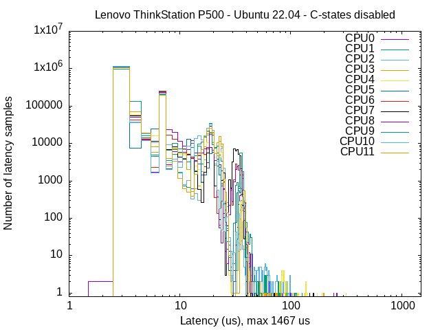 | 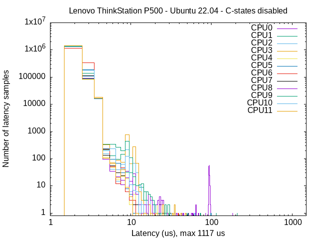 |
| :----------------------------------------------------------- | ------------------------------------------------------------ |
| Lenovo ThinkStation P500 running an **unpatched** `5.15.0-58-generic` kernel with **C-states enabled** | Lenovo ThinkStation P500 running an **unpatched** `5.15.0-58-generic` kernel with **C-states disabled** |

| 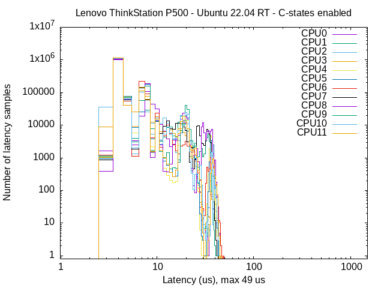 | 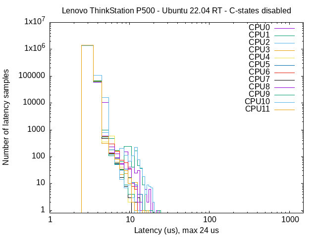 |
| :----------------------------------------------------------- | ------------------------------------------------------------ |
| Lenovo ThinkStation P500 running a **`PREEMPT_RT`-patched** `5.15.86-rt56` kernel with **C-states enabled** | Lenovo ThinkStation P500 running **`PREEMPT_RT`-patched** `5.15.86-rt56` kernel with **C-states disabled** |

#### Lenovo ThinkPad T14

| 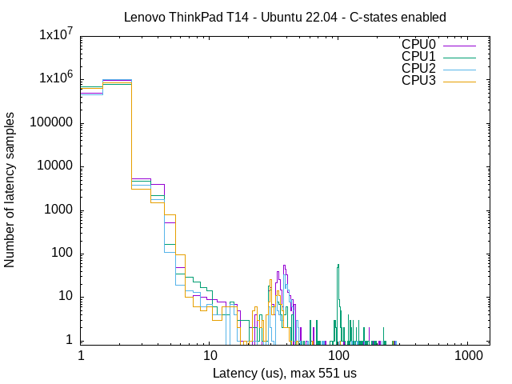 | 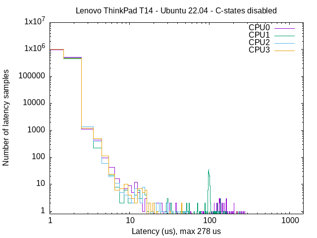 |
| :----------------------------------------------------------- | ------------------------------------------------------------ |
| Lenovo ThinkPad T14 running an **unpatched** `5.15.0-58-generic` kernel with **C-states enabled** | Lenovo ThinkPad T14 running an **unpatched** `5.15.0-58-generic` kernel with **C-states disabled** |

| 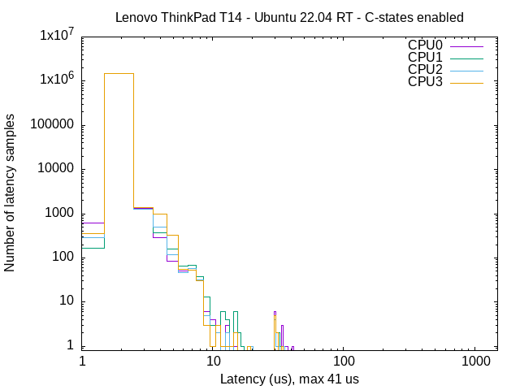 | 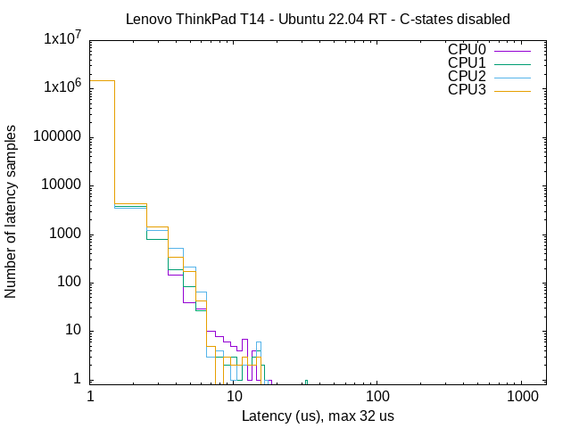 |
| :----------------------------------------------------------- | ------------------------------------------------------------ |
| Lenovo ThinkPad T14 running a **`PREEMPT_RT`-patched** `5.15.86-rt56` kernel with **C-states enabled** | Lenovo ThinkPad T14 running **`PREEMPT_RT`-patched** `5.15.86-rt56` kernel with **C-states disabled** |

### 1.1 Known issues

The `PREEMPT_RT` patched-kernels are known for causing a headache with the **official Nvidia graphics driver**, at least the binary versions of it. Please have a look yourself before deciding to continue if you have an Nvidia GPU. Potentially you might end up with the Nouveau Linux graphics driver with a lower refresh rate or lower resolution and for laptops you might lose access to your external display depending on the precise computer architecture and graphics card. If you have an Nvidia card and decide to continue open **`Software & Updates`**, browse **`Additional Drivers`** and **select `X.Org X server - Nouveau display driver` as the driver for your graphics card** as shown in the screenshot below.

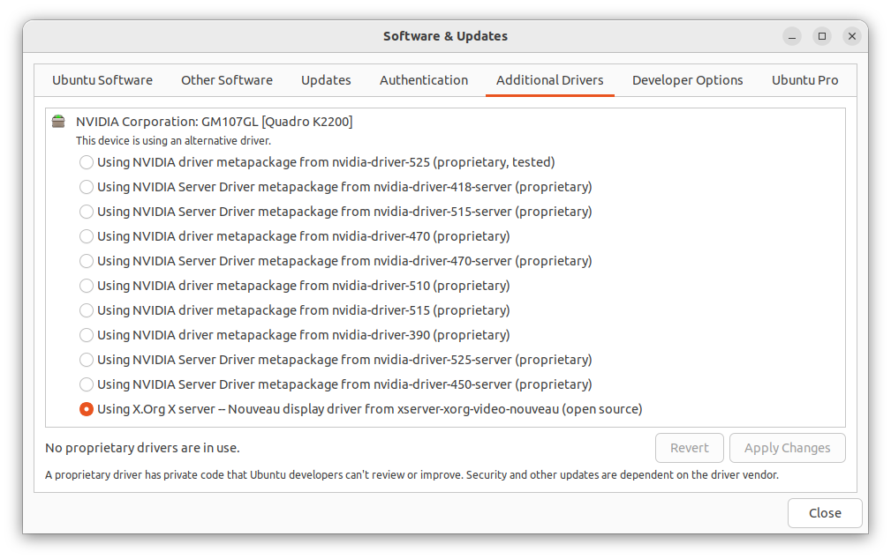


### 1.2 Installation

The installation of `PREEMPT_RT` can be performed either by installing the patch from an existing Debian package or by re-compiling the kernel yourself. As of 2023 and Ubuntu 22.04 the a `PREEMPT_RT` kernel can also be installed through **Ubuntu Pro** (see the installation procedure below!). If you are using Ubuntu this is definitely the **preferred option**.

In case you can't or don't want to use it I have also outlined the installation from Debian as well as from source code. While the first option should be preferred for having a more detailed control over the kernel set-up latter might still be desired or might be your only options in rare cases of lacking compatibility. I have provided two scripts [`src/install_debian_preemptrt`](./src/install_debian_preemptrt) and [`src/compile_kernel_preemptrt`](./src/compile_kernel_preemptrt) which are able to install either from an existing Debian package or by recompiling the kernel automatically. This means it should not be necessary to perform this steps manually in any case. Nonetheless the required steps are also discussed in the section below. Before using the scripts be sure to make them executable on your system with `$ sudo chmod +x install_debian_preemptrt`.


#### 1.2.1 Ubuntu real-time kernel (recommended)

From Ubuntu 22.04 onwards there is a [real-time kernel based on `PREEMPT_RT` already available out of the box](https://ubuntu.com/blog/real-time-ubuntu-released). For **personal use** you can **register up to five machines for free** while commercial customers will have to sign up for a [subscription](https://ubuntu.com/pro/subscribe). This is by far the easiest installation method so I can highly recommend it!

For this you will have to register for [**Ubuntu One**](https://login.ubuntu.com/). You can then log into [**Ubuntu Pro**](https://ubuntu.com/pro/) with it. Your dashboard on Ubuntu Pro will show your current **token**, I have blurred mine out in the following screenshot. Copy it, you will need it for registering new machines.

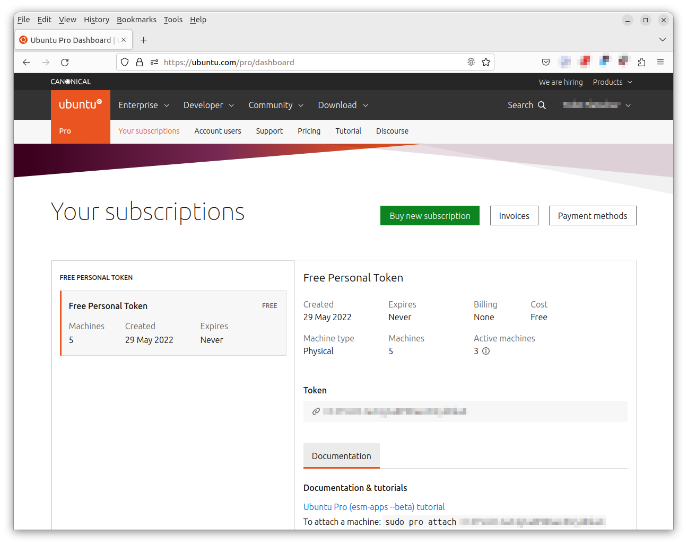

Now open a new terminal on your **machine** and connect it to your **Ubuntu Pro** account with `$ sudo pro attach <your_token>`:

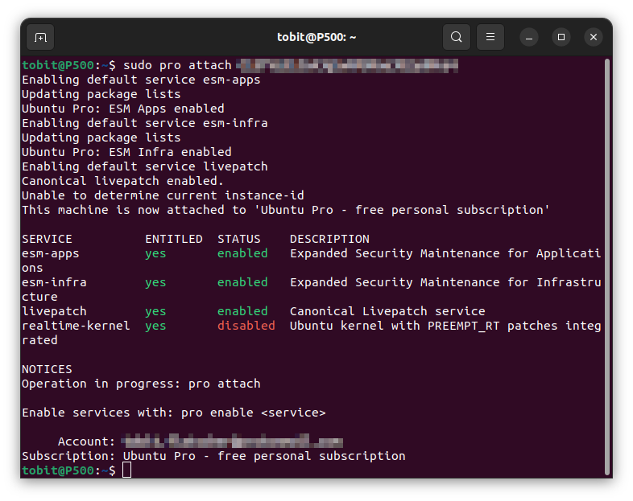

Continue to **activate the Ubuntu realtime-kernel** with `$ sudo pro enable realtime-kernel` and confirming twice with `y`:

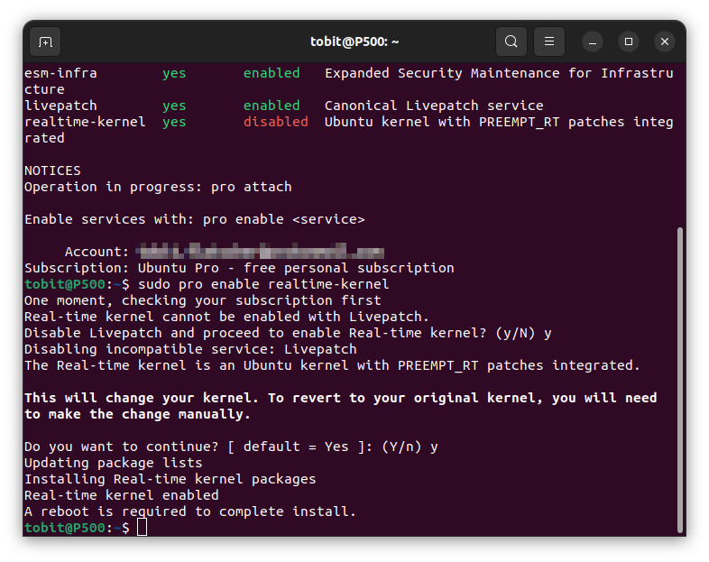

After **rebooting** your Ubuntu Pro status `$ pro status` should be similar to the following screenshot with the `realtime-kernel` showing up as activated:

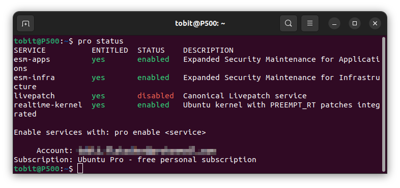

Make sure you actually also **boot into the real-time kernel**. Make sure that `$ uname -r` actually outputs something like `5.15.0-1032-realtime` and not your regular kernel! The installation installs it but does not automatically boot into it!


#### 1.2.2 Installation from Debian package

The installation from a Debian package is way **simpler** than the recompilation listed below but is at the same time **less flexible** as it is only available for a limited number of kernels and kernel configurations. You might not be able to make the Debian package work with your particular system and might have to re-compile the kernel anyways. Nonetheless it is **highly advised** that you follow these simple steps before turning to a full re-compilation of the kernel. I have provided a script for that as well as outlined the steps that are performed by the script below.

##### 1.2.2.1 Installation via script

Start of by launching [`src/install_debian_preemptrt`](./src/install_debian_preemptrt) and follow the installation instructions

```shell
$ cd src
$ mkdir tmp
$ cd tmp
$ ./../install_debian_preemptrt
```

Below are shown screenshots of the installation script:

|  | 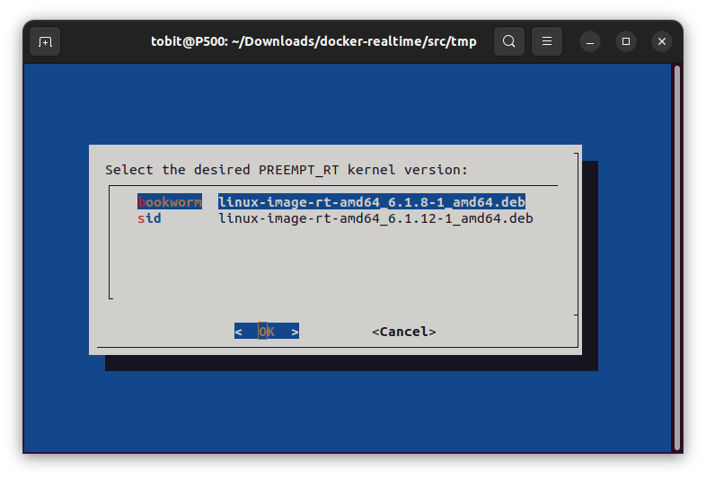 |
| ------------------------------------------------------------ | ------------------------------------------------------------ |
| 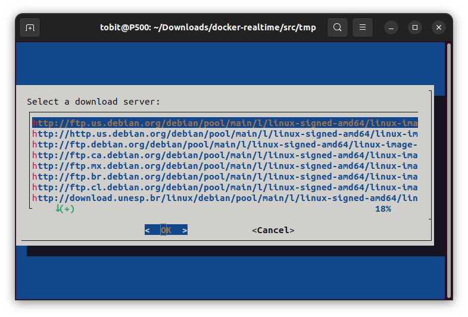 | 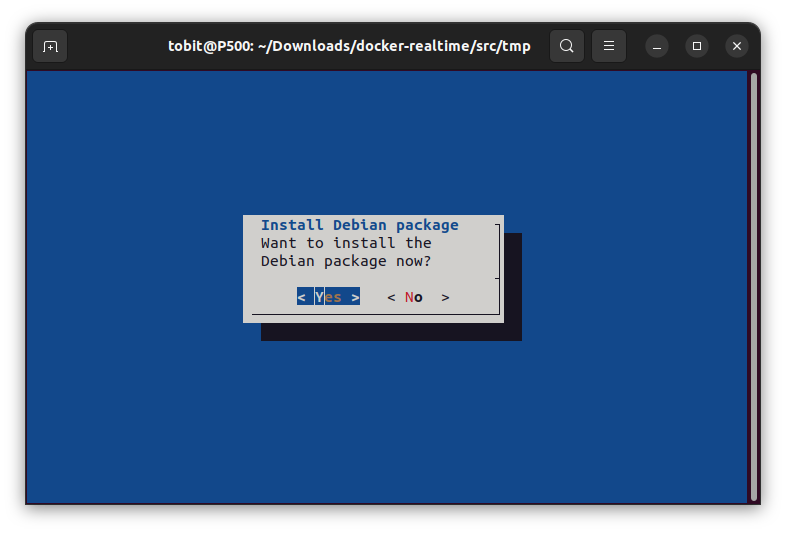 |

Afterwards you can reboot your system (be sure to select the correct kernel!) and should already be ready to go. You can check the kernel version with `$ uname -r` to verify that you are using the correct kernel and the installation was indeed successful. Quite often this installation might fail due to missing dependencies. I am not completely sure what is the issue there but in case this does not work you will have to compile the kernel yourself as outlined in the next section.

##### 1.2.2.2 Manual installation

Have a look at the search results resulting from [this query on package.debian.org](https://packages.debian.org/search?keywords=linux-image-rt-amd64) (potentially changing the architecture!) and see if you can find a kernel close to yours, e.g. [this one](https://packages.debian.org/bullseye/linux-image-rt-amd64). If you can find one click on the architecture `amd64` under `Download linux-image-rt-amd64` on the bottom and select a geographically suiting mirror and save the image in a location of your choice.

Finally install it by opening a terminal in this folder and typing

```shell
$ sudo dpkg -i linux-image-rt-amd64_5.10.106-1_amd64.deb
$ sudo apt-get install -f
```

Jump to section 1.3 and then try to reboot. In case it does not work you will have to go for the full recompilation of the kernel as described in the section below, else congratulations you have saved yourself some time and effort!


#### 1.2.3 Re-compilation of the kernel

If you can't install a patched kernel from an existing Debian package you will have to re-compile a kernel for yourself. This procedure is a very slow and painful process in particular if you do it for the first time. I have again tried to simplify it by providing a script for it and outlined the lengthy manual installation process as well.

##### 1.2.3.1 Installation via script

If the installation above fails (or for some good reason you have to compile the kernel yourself) you can use the [`src/compile_kernel_preemptrt`](./src/compile_kernel_preemptrt) script.

You can launch it in two different ways:

```shell
$ cd src
$ mkdir tmp
$ cd tmp
$ ./../compile_kernel_preemptrt
```

will install the required dependencies and then open a dialog which lets you browse the possible versions and available options manually, reducing the copy and paste operations.

If you supply a correct real-time patch version from the list of available ones as an input argument, launching the command with superuser privileges it will download all files, patch the kernel, create a Debian package if no official one is available and install it automatically.

```shell
$ cd src
$ mkdir tmp
$ cd tmp
$ sudo ./../compile_kernel_preemptrt 5.10.78-rt55
```

This might be helpful for deploying a new kernel automatically on a remote system. The possible version numbers to be passed as arguments can be found at [here](https://mirrors.edge.kernel.org/pub/linux/kernel/projects/rt/).

Below are shown screenshots of the installation script:

| 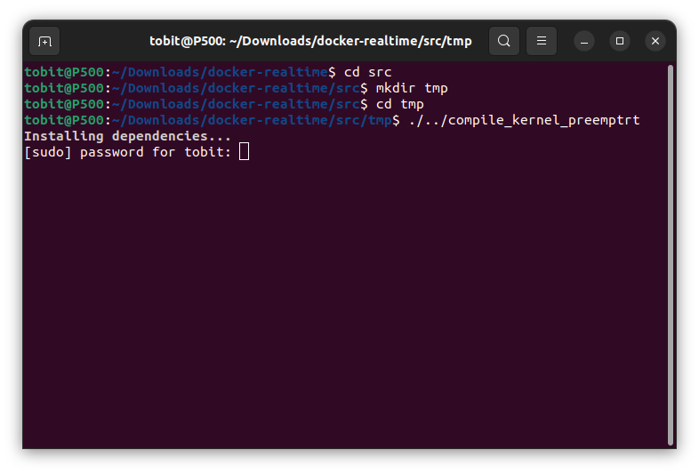 | 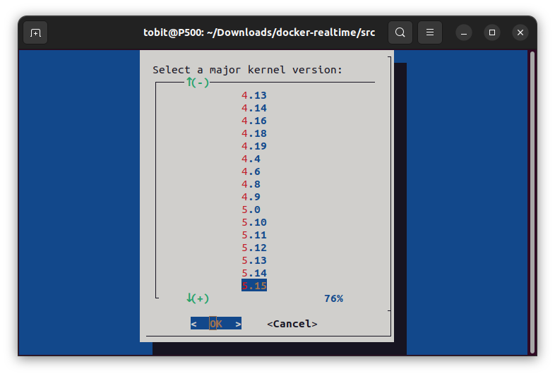 |
| ------------------------------------------------------------ | ------------------------------------------------------------ |
| 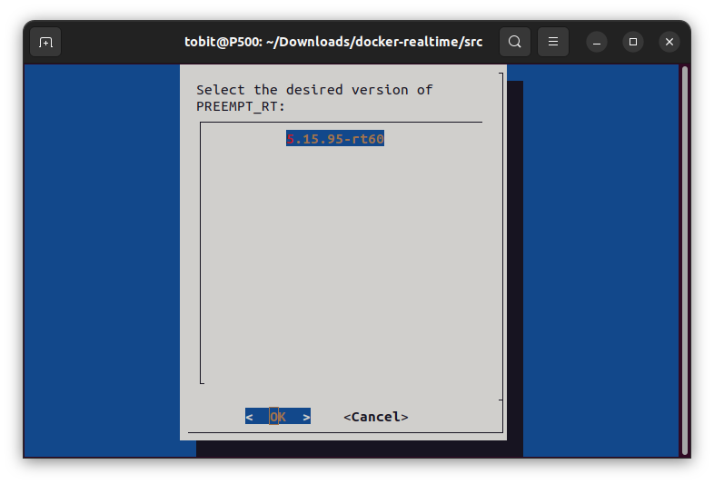 | 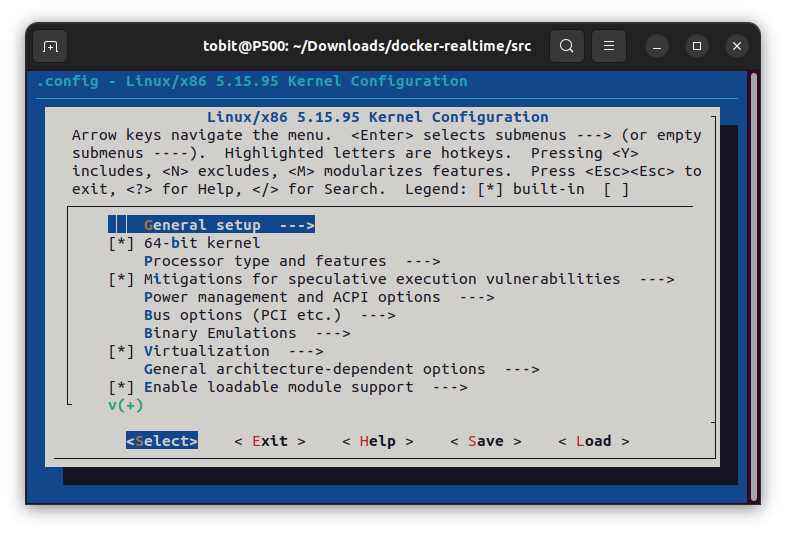 |
| 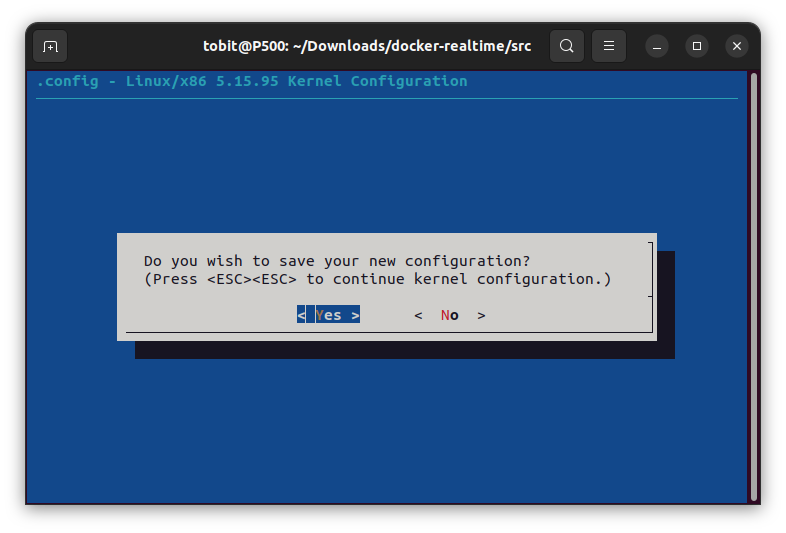 | 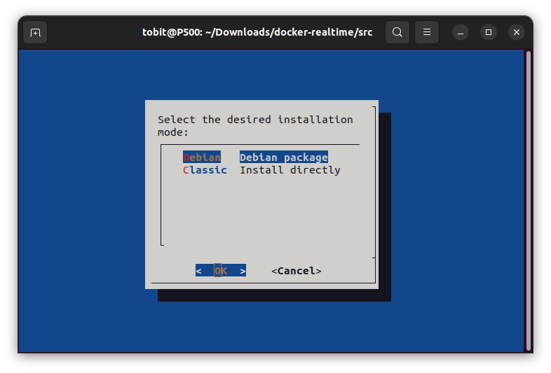 |


##### 1.2.3.2 Manual installation

The re-compilation of the kernel is described in the [official Ubuntu installation guide](https://help.ubuntu.com/lts/installation-guide/amd64/install.en.pdf#page=98) as well as on the [Franka Emika installation guide](https://frankaemika.github.io/docs/installation_linux.html#setting-up-the-real-time-kernel) page but [might depend on the precise version](https://stackoverflow.com/a/51709420). In case you are running into issues you might have to consider [this](https://askubuntu.com/a/1338150) and [this](https://askubuntu.com/a/1329625) post. As already mentioned the script `src/compile_kernel_preemptrt` does the steps that are listed in this section. Therefore it should not be necessary for you to do the following steps manually!

Start by installing the packages required for the re-compilation. For a Debian-based Linux distribution this can be done conveniently with:

```shell
$ sudo apt-get install -y build-essential bc curl ca-certificates gnupg2 libssl-dev lsb-release libelf-dev bison flex dwarves zstd libncurses-dev fakeroot kernel-package linux-source equivs gcc dpkg-dev
```

Then have a look at [this webpage](https://mirrors.edge.kernel.org/pub/linux/kernel/projects/rt/) and select a **patch version to install**, e.g. `5.10.78-rt55` under `5.10` (the versions are updated quite frequently, so this precise version might not work when you read this). Ideally the selected kernel version **should be close to your current kernel version**.

```shell
$ PREEMPT_RT_VER_FULL="5.10.78-rt55" # Modify the patch version here (e.g. 5.10.78-rt55)
$ KERNEL_VER_FULL=$(echo "${PREEMPT_RT_VER_FULL}" | sed 's/-rt.*//g') # e.g. 5.10.78
$ PREEMPT_RT_VER=$(echo "${KERNEL_VER_FULL}" | sed 's/\.[^\.]*//2g') # e.g. 5.10
$ KERNEL_VER="v"$(echo "${PREEMPT_RT_VER}" | sed -n 's/\(.*\)[.]\(.*\)/\1.x/p') # e.g. v5.x
```

The lines above will create several variables that will be handy in the next steps. If the lines fail, print the values of the variables with `$ echo ${PATCH_VER_FULL}` and then make sure that the following links exist on the [server](https://mirrors.edge.kernel.org/pub/linux/kernel/v5.x/).

**Download and extract the wished kernel and real-time patch** as follows:

```shell
$ curl -SLO --fail https://www.kernel.org/pub/linux/kernel/v${KERNEL_VER}/linux-${KERNEL_VER_FULL}.tar.xz
$ curl -SLO --fail https://www.kernel.org/pub/linux/kernel/v${KERNEL_VER}/linux-${KERNEL_VER_FULL}.tar.sign
$ xz -d linux-${KERNEL_VER_FULL}.tar.xz

$ curl -SLO --fail https://mirrors.edge.kernel.org/pub/linux/kernel/projects/rt/${PREEMPT_RT_VER}/patch-${PREEMPT_RT_VER_FULL}.patch.xz
$ curl -SLO --fail https://mirrors.edge.kernel.org/pub/linux/kernel/projects/rt/${PREEMPT_RT_VER}/patch-${PREEMPT_RT_VER_FULL}.patch.sign 
$ xz -d patch-${PREEMPT_RT_VER_FULL}.patch.xz
```

Verifying the file integrity is not necessary but highly recommended in order to make sure that the files are not corrupted and nobody modified them as described in more detail [here](https://www.kernel.org/signature.html). This can be done with `gpg2` as follows:

 ```shell
gpg2 --verify linux-${KERNEL_VER_FULL}.tar.sign
gpg2 --verify patch-${PREEMPT_RT_VER_FULL}.patch.sign
 ```

In case your output is `gpg: Can't check signature: No public key` you will have to download the public key of the person who signed the file by taking the given `RSA key ID` and obtain it:

```bash
gpg2 --keyserver hkp://keyserver.ubuntu.com:80 --recv-keys <key>
```

After this you should be able to repeat the procedure, sign the key and proceed to extract the wished kernel:

```shell
$ tar xf linux-${KERNEL_VER_FULL}.tar
```

then continue to patch the freshly extracted kernel.

 ```shell
 $ cd linux-${KERNEL_VER_FULL}
 $ patch -p1 < ../patch-${PREEMPT_RT_VER_FULL}.patch
 ```

and **generate a new configuration** `.config` file with

```shell
$ make oldconfig
```

Go ahead and **change the relevant configuration parameters** if you want to. This can be done graphically with `$ make xconfig`, `$ make menuconfig` or manually by modifying the `.config` file located inside `linux-${KERNEL_VER_FULL}`. The [German Open Source Automation Development Lab (OSADL) ](https://www.osadl.org/) performs long-term tests on several kernel versions and publishes the results on the internet. One might want to use these parameters instead rather than working with his/her own `.config` file. An overview of the corresponding systems can be found [here](https://www.osadl.org/Real-time-optimization.qa-farm-latency-optimization.0.html) and the configuration file for a particular system can be downloaded (e.g. [this one](https://www.osadl.org/?id=1087#kernel)). If you set incompatible flags they might be reset later on. As soon as the kernel compilation starts **check the `.config` file if your desired settings are still set** or if they were implicitly discarded. If you want to see what the configuration of your current kernel looks like [type `$ cat /boot/config-$(uname -r)` in your console](https://www.baeldung.com/linux/kernel-config). 

I personally generally use the following settings (for a more detailed information what these parameters mean precisely refer to [this great introduction to the Linux kernel](https://wxdublin.gitbooks.io/deep-into-linux-and-beyond/content/idle_scheduling_class.html)):

```shell
# Find and replace
CONFIG_HZ_1000=y # Requires to comment the other entries such as CONFIG_HZ=250
CONFIG_HZ=1000
CONFIG_NO_HZ_IDLE=y
CONFIG_NO_HZ=y
CONFIG_HIGH_RES_TIMERS=y
CONFIG_CPU_ISOLATION=y
```

For a successful installation I have to change the following parameters inside the `.config` file:

```shell
# Find and replace
CONFIG_SYSTEM_TRUSTED_KEYS=""
CONFIG_SYSTEM_REVOCATION_KEYS=""
```

If your compilation fails nonetheless retry modifying these parameters as well:

```shell
# Find and replace if compilation fails
CONFIG_MODULE_SIG=n
CONFIG_MODULE_SIG_ALL=n
CONFIG_MODULE_SIG_FORCE=n
CONFIG_MODULE_SIG_KEY=""
CONFIG_X86_X32=""
```

Now it is time to build the kernel:

- If you want to build a **Debian package** (recommended) then perform:

  ```shell
  $ make clean # Optional to remove old relicts (from previously failed compilations)
  # The following command might take very long!
  $ sudo make -j$(nproc) deb-pkg
  ```
  
  where the [`revision` parameter is just for keeping track of the version number of your kernel builds](https://www.debian.org/releases/wheezy/amd64/ch08s06.html.en) and can be changed at will, similarly for the `custom` word.
  
  In case you want to remove it again later on this can be easily done with:
  
  ```shell
  $ PREEMPT_RT_VER_FULL="5.10.78-rt55" # Modify the kernel version here
  $ sudo dpkg -r linux-image-${PREEMPT_RT_VER_FULL}
  ```
  
  The advantage of the Debian package is that you can distribute and remove it more easily than the direct installation. 
  
- Alternatively you can build and **install it directly** without creating a Debian package first

  ```shell
  $ sudo make -j$(nproc)
  $ sudo make modules_install -j$(nproc)
  $ sudo make install -j$(nproc)
  ```

Continue to restart the computer and boot into the newly installed kernel. Depending on the chosen installation procedure and BIOS set-up you **might have to turn off secure boot** in your UEFI BIOS menu or else you might not be able to boot. You can verify if you booted into the correct kernel by executing `$ uname -r` in the console. If set-up correctly your kernel should contain `rt` in its version and `/sys/kernel/realtime` should exist and contain the value `1`. In order to check if the kernel compiled correctly you can output the kernel flags with [this tool](https://raw.githubusercontent.com/docker/docker/master/contrib/check-config.sh).


### 1.3 Allowing the user to set real-time permissions

By default only your super-user will be able to set real-time priorities (see `$ ulimit -r`). In case you do not intend to use [`root` as the user inside the Docker](https://medium.com/jobteaser-dev-team/docker-user-best-practices-a8d2ca5205f4) you will have to remove this restriction and you will have add a group named `realtime` (the name of the group is your choice and you could also only add a single user instead of a dedicated group) and add our current user to it as described in the [Franka Emika Linux installation guide](https://frankaemika.github.io/docs/installation_linux.html). First execute

```bash
$ sudo addgroup realtime
$ sudo usermod -a -G realtime $(whoami) # Or another user if you are using another name inside the Docker
```

and then adapt the [PAM limits](https://wiki.gentoo.org/wiki/Project:Sound/How_to_Enable_Realtime_for_Multimedia_Applications) located under `/etc/security/limits.conf` (as described [here](https://serverfault.com/questions/487602/linux-etc-security-limits-conf-explanation)) in the following way:

```
@realtime     soft    rtprio          99
@realtime     soft    priority        99
@realtime     soft    memlock     102400
@realtime     hard    rtprio          99
@realtime     hard    priority        99
@realtime     hard    memlock     102400
```

In this context `rtprio` is the maximum real-time priority allowed for non-privileged processes. The `hard` limit is the real limit to which the `soft` limit can be set to. The `hard` limits are set by the super-user and enforce by the kernel. The user cannot raise his code to run with a higher priority than the `hard` limit. The `soft` limit on the other hand is the default value limited by the `hard` limit. For more information on the parameters see e.g. [here](https://linux.die.net/man/5/limits.conf).


### 1.4 Set real-time schedule

The real-time schedule of a process can be set from the command line with `chrt` as discussed [here](https://askubuntu.com/questions/51283/how-to-run-a-program-with-sched-rr-policy-from-command-line).


### 1.5 Set boot order

Likely after installing your new kernel you will want to boot automatically into the real-time kernel and not have to press `ESC` upon start every single time. This can be done by **changing the Grub boot order** either [manually](https://askubuntu.com/a/110738) or by [using the graphical tool by Daniel Richter](https://askubuntu.com/a/100246) (recommended). Latter can be installed with the following commands

````sh
$ sudo add-apt-repository ppa:danielrichter2007/grub-customizer
$ sudo apt-get update
$ sudo apt-get install grub-customizer
````

and then launched

````sh
$ sudo grub-customizer
````

Select the desired kernel as default under `General/default entry/predefined` (see image below), close the GUI and restart your computer.

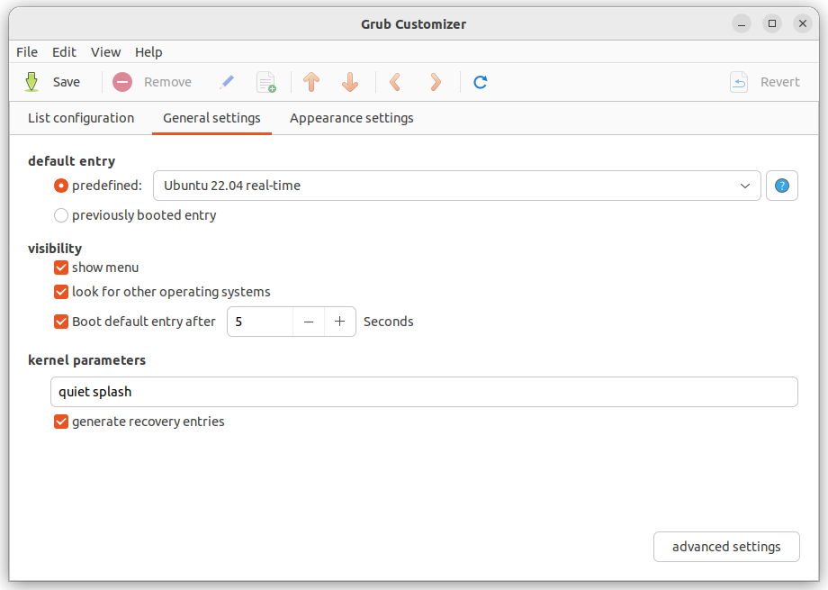

You should now automatically boot into your freshly installed `PREEMPT_RT`-patched kernel.
