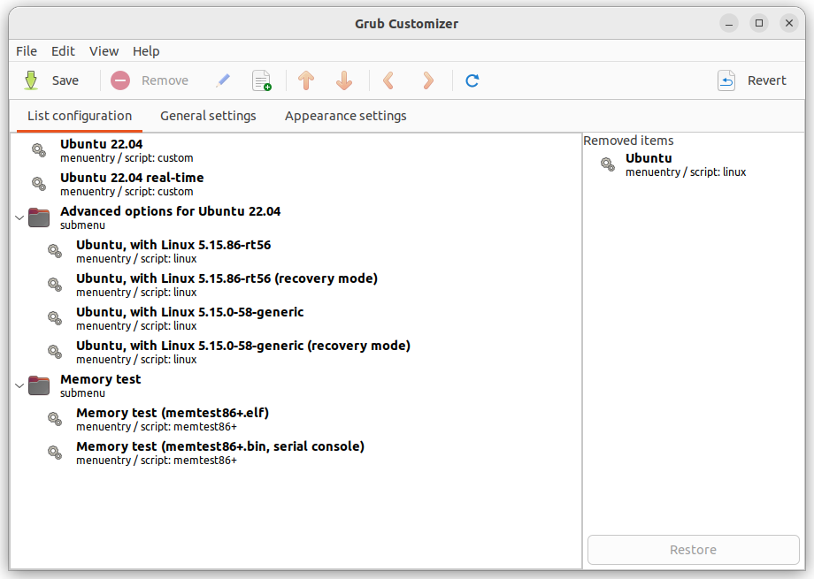
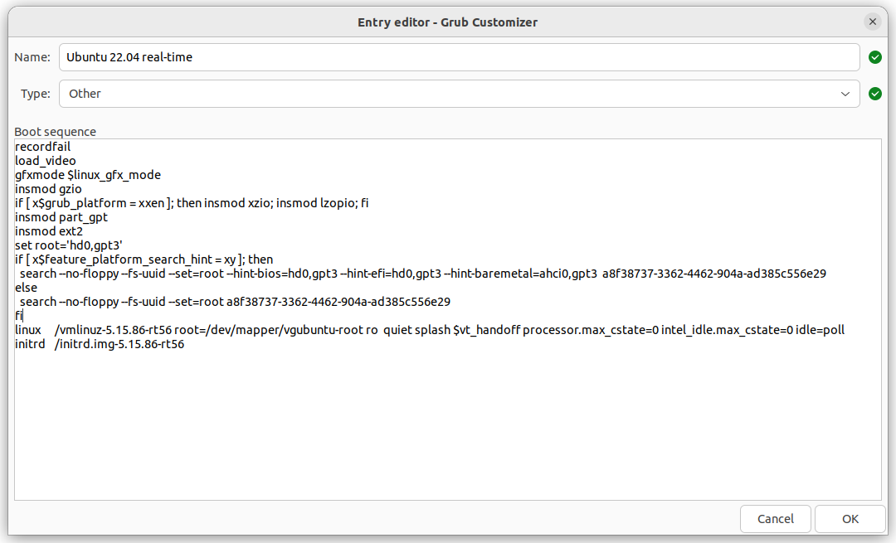
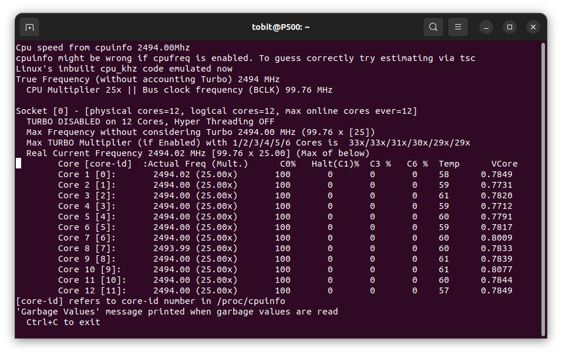
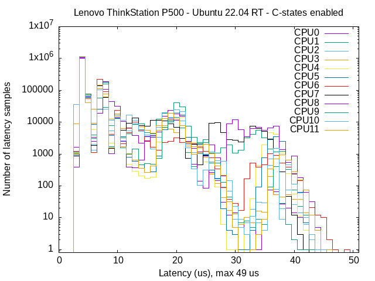
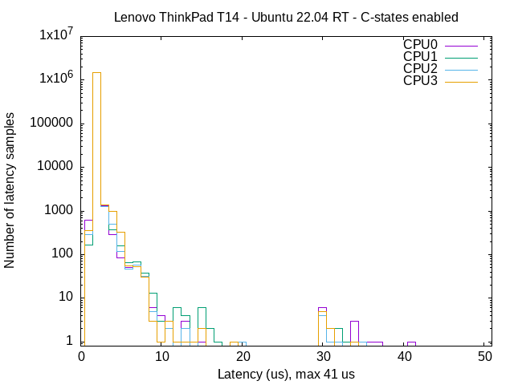
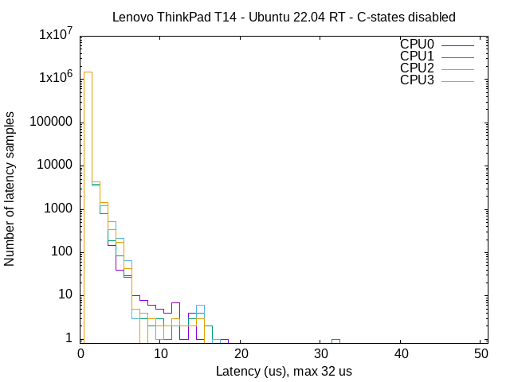

# Real-time Optimizations

Author: [Tobit Flatscher](https://github.com/2b-t) (2022 - 2024)


## 1. Introduction

The following sections will outline a few things to consider when setting up a real-time capable systems and optimizations that should help improve its real-time performance significantly and different techniques for benchmarking the real-time performance of a system. This guide is largely based on the exhaustive [**Red Hat optimisation guide**](https://access.redhat.com/documentation/en-us/red_hat_enterprise_linux_for_real_time/8/html-single/optimizing_rhel_8_for_real_time_for_low_latency_operation/index), focusing on particular aspects of it. Additional information can be found in the [Ubuntu real-time kernel tuning guide](https://ubuntu.com/blog/real-time-kernel-tuning) as well as [here](https://rigtorp.se/low-latency-guide/).

## 2. Selecting hardware

The latency on most computers that are optimised for energy efficiency - like laptops - will be a magnitude or two larger than the one of a desktop system as can also clearly be seen [browsing the OSADL latency plots](https://www.osadl.org/Latency-plots.latency-plots.0.html). **It is therefore generally not advisable to use laptops for real-time tests** (with and without a Docker): Some might have decent performance most of the time but might result in huge latencies in the magnitude of milliseconds when run over an extended period. Some single-board computers like the Raspberry Pi, [seem to be surprisingly decent](https://metebalci.com/blog/latency-of-raspberry-pi-3-on-standard-and-real-time-linux-4.9-kernel/) but still can't compete with a desktop computer. The Open Source Automation Development Lab eG (OSADL) performs long-term tests on several systems that can be inspected [on their website](https://www.osadl.org/OSADL-QA-Farm-Real-time.linux-real-time.0.html) in case you want to compare the performance of your system to others.

## 3. Kernel parameters

Real-time performance might be improved by **changing kernel parameters when recompiling the kernel**. On the [OSADL long-term test farm website](https://www.osadl.org/Real-time-optimization.qa-farm-latency-optimization.0.html) you can inspect and download the kernel configuration for a particular system (e.g. [here](https://www.osadl.org/?id=1312#kernel)). Important settings that might help reduce latency include disabling all irrelevant debugging feature. The parameters of your current configuration can be displayed with  [`$ cat /boot/config-$(uname -r)`](https://www.baeldung.com/linux/kernel-config).

The operating system uses [system tick time](https://issuu.com/hibadweib/docs/open_source_for_you_-_october_2012/s/13663273) to generate interrupt requests for scheduling events that can cause a context switch for time-sliced/round-robin scheulding of tasks with the same priority. The resolution of this timer ticks can be adjusted improving the accuracy of timed events.

For Linux the currently highest supported **tick rate** is **1000Hz** and can be set with the [kernel parameter](https://ubuntu.com/blog/industrial-embedded-systems-ii):

```shell
CONFIG_HZ_1000=y # Requires to comment the other entries such as CONFIG_HZ=250
CONFIG_HZ=1000
```

In order to be more performant one can also stop the periodic ticks on idle and further omit the scheduling ticks on CPUs that only have one runnable task as described [here](https://www.kernel.org/doc/Documentation/timers/NO_HZ.txt) as well as [here](https://www.suse.com/c/cpu-isolation-introduction-part-1/):

```shell
CONFIG_NO_HZ_IDLE=y
CONFIG_NO_HZ_FULL=y
```

Latter allows to improve worst-case latency by the duration of the scheduling-clock interrupt. One has to explicitly mark the CPUs that this should be applied to with `nohz_full=6-8` but it is not possible to mark all of the CPUs as adaptive-tick CPUs! By using the kernel parameter `CONFIG_NO_HZ_FULL_ALL=y` one can activate this mode for all CPUs except the boot CPU.

For lock-less programming Linux has a [read-copy update (RCU)](https://en.wikipedia.org/wiki/Read-copy-update) synchronization mechanism that avoids lock-based primitives when multiple threads concurrently read and update elements that are linked through pointers and belong to shared data structures avoiding inconsistencies. This mechanisms sometimes [queues callbacks on CPUs to be performed at a future moment](https://access.redhat.com/documentation/de-de/red_hat_enterprise_linux_for_real_time/7/html/tuning_guide/offloading_rcu_callbacks). One can exclude certain CPUs from running RCU callbacks by compiling the kernel with

```shell
CONFIG_RCU_NOCB_CPU=y
```

and later specifying a list of CPUs that this should be applied to with e.g. `rcu_nocbs=6-8`.

## 4. CPU frequency scaling and sleep states

During operation the **operating system may scale the CPU frequency up and down** in order to improve performance or save energy. Responsible for this are

- The **scaling governor**: Algorithms that compute the CPU frequency depending on the load etc.
- The **scaling driver** that interacts with the CPU to enforce the desired frequency 

For more detailed information see e.g. [Arch Linux](https://wiki.archlinux.org/title/CPU_frequency_scaling).

While these settings might help save energy, they generally increase latency and should thus be **de-activated on real-time systems**.

On Intel CPUs (and [similarly on AMD processors](https://www.kernel.org/doc/html/latest/admin-guide/pm/amd-pstate.html)) the driver offers [two possibilities](https://lenovopress.lenovo.com/lp0632.pdf) to reduce the power consumption (see e.g. [here](https://vstinner.github.io/intel-cpus.html) and [here](https://docs.01.org/clearlinux/latest/guides/maintenance/cpu-performance.html) as well as the documentation on the Linux kernel [here](https://docs.kernel.org/admin-guide/pm/intel_pstate.html) or [here](https://metebalci.com/blog/a-minimum-complete-tutorial-of-cpu-power-management-c-states-and-p-states/) for a technical in-depth overview):

- **P-states**: The processor can be run at lower voltages and/or frequency levels in order to decrease power consumption
- **C-states**: Idle states, where subsystems are powered down.

Both states are numbered, where 0 corresponds to operational state with maximum performance, and the higher levels corresponding to power-saving (likely latency-increasing) modes.

From my experience the major impact on latency have the C-states while changing the P-states to performance has only a minor influence if any. Often one can change both of these settings in the BIOS but the Linux operating systems often discard the corresponding BIOS settings. It is therefore important to configure the operating system accordingly as we will see in the next section.

Additionally there are other dynamic frequency scaling features, like [**Turbo-Boost**](https://en.wikipedia.org/wiki/Intel_Turbo_Boost) that allow to temporarily raise the operating frequency above the nominal frequency when demanding tasks are run. To what degree this is possible depends on the number of active cores, current and power consumption as well as CPU temperature. Values for different processors can be found e.g. on [WikiChip](https://en.wikichip.org/wiki/intel). This feature can be deactivated inside the operating system as well as the BIOS and is often de-activated on servers that are supposed to run 24/7 on full load. For best real-time performance you should **turn hyperthreading off**.

### 4.1 C-states

It is essential to low latencies to disable the idle states of the processor (see the section below for actual benchmarks). This can be done in several different ways as described [here](https://wiki.bu.ost.ch/infoportal/_media/embedded_systems/ethercat/controlling_processor_c-state_usage_in_linux_v1.1_nov2013.pdf#page=5):

- One can use **kernel parameters** such as `intel_idle.max_cstate=0` for disabling the Intel driver or `processor.max_cstate=0 idle=poll` for keeping the processor constantly in C0. These approaches are permanent and can only be changed after a reboot.

- One can control them **dynamically through the [`/dev/cpu_dma_latency` file](https://access.redhat.com/articles/65410)**. One opens it and writes the maximum allowable latency. With the [following command](https://www.golinuxhub.com/2018/06/what-cpu-c-states-check-cpu-core-linux/) the latency values of the different states can be determined

  ```shell
  $ cd /sys/devices/system/cpu/cpu0/cpuidle
  $ for state in state{0..4} ; do echo c-$state `cat $state/name` `cat $state/latency` ; done
  ```

   If `0` is set this will keep the processor in `C0`. It is important that this file must be kept open when closing it the processor will be allowed to idle again.
  The [value of the `/dev/cpu_dma_latency` file is given in hexadecimal](https://www.golinuxhub.com/2018/06/what-cpu-c-states-check-cpu-core-linux/) and can be read with: 

  ```bash
  $ HEX_LATENCY=$(sudo xxd -p /dev/cpu_dma_latency | tac -rs .. | echo "$(tr -d '\n')") && echo $((0x${HEX_LATENCY}))
  ```

  Finally one can also set the C-states for **each core independently dynamically** by writing to `/sys/devices/system/cpu/cpu${i}/cpuidle/${cstate}/disable` for each CPU core `${i}` in `$(nproc)` and each [`${cstate}` in `ls /sys/devices/system/cpu/cpu0/cpuidle | grep state`](https://askubuntu.com/a/1242574).

I personally prefer the first option as when I am working on real-time relevant code I do not want to call a script every time. Instead I will boot into a **dedicated kernel with the corresponding kernel parameters activated**. I will generate another boot entry using [Grub-Customizer](https://itsfoss.com/install-grub-customizer-ubuntu/) (see screenshots below), called `Ubuntu 22.04 real-time` where I basically clone the `X.XX.XX-rtXX` configuration [adding `processor.max_cstate=0 intel_idle.max_cstate=0 idle=poll`](https://access.redhat.com/articles/65410) (see second-last line of the screenshot on the right).

|  |  |
| :---------------------------------------------------------- | ----------------------------------------------------------- |
| Grub configuration                                          | Disabling C-states just for the PREEMPT_RT kernel           |

After boot you can use [`$ cat /proc/cmdline` to double check the settings](https://askubuntu.com/a/19487). 

Additionally [`i7z` can be very useful for monitoring the C-states](https://wiki.bu.ost.ch/infoportal/_media/embedded_systems/ethercat/controlling_processor_c-state_usage_in_linux_v1.1_nov2013.pdf#page=5). After installing it with

```bash
$ sudo apt-get install i7z
```

continue to run it with

```bash
$ sudo i7z
```

It will show you the percentage of time that each individual core is spending in a particular C-state:



Additionally there is [`cpupower`](https://manpages.ubuntu.com/manpages/impish/man1/cpupower-idle-set.1.html). The problem with it is though that it is specific for a kernel, meaning it has be downloaded through `$ sudo apt-get install linux-tools-$(uname -r)` and is generally not available for a real-time kernel that you compiled from source, meaning you would have to compile it as well when compiling the kernel!

### 4.2 Cyclictest

An important test for **evaluating the latencies of a real-time system caused by hardware, firmware and operating system as a whole** is the [`cyclictest`](https://wiki.linuxfoundation.org/realtime/documentation/howto/tools/cyclictest/start). It repeatedly measures the difference between a thread's intended and actual wake-up time (see [here](https://events.static.linuxfound.org/sites/events/files/slides/cyclictest.pdf) for more details). For real-time purposes the **worst-case latency** is actually far more important than the average latency as any violation of a deadline might be fatal. Ideally we would want to test it in combination with a **stress test** such as [`$ stress-ng -c $(nproc)`](https://wiki.ubuntu.com/Kernel/Reference/stress-ng) and run it for an **extended period of times** (hours, days or even weeks).

The effectiveness of turning the C-states off is evaluated for two systems, a [**Lenovo ThinkStation P500 tower**](https://www.getech.co.uk/pdf/p5001.pdf) (with an [Intel(R) Xeon(R) E5-2680 v3 @ 2.50GHz twelve-core CPU](https://ark.intel.com/content/www/us/en/ark/products/81908/intel-xeon-processor-e52680-v3-30m-cache-2-50-ghz.html) and 32GB of ECC-DDR4-RAM) and a [**Lenovo ThinkPad T14 Gen1 notebook**](https://psref.lenovo.com/syspool/Sys/PDF/ThinkPad/ThinkPad_T14_Gen_1_Intel/ThinkPad_T14_Gen_1_Intel_Spec.PDF) (with an [Intel(R) Core(TM) i5-10210U quad-core CPU](https://www.intel.co.uk/content/www/uk/en/products/sku/195436/intel-core-i510210u-processor-6m-cache-up-to-4-20-ghz/specifications.html) and 16GB of DDR4-RAM). In both cases a `cyclictest` with the following parameters is performed:

```bash
$ cyclictest --latency=750000 -D5m -m -Sp90 -i200 -h400 -q
```

Make sure to set an appropriate priority with the flag `-p`, e.g. `-p90` (and potentially also the policy with `--policy`, e.g. `--policy=fifo`) as otherwise a low default priority will be assumed not reflecting the actual performance of the system. The parameter `latency` here is essential as per default `cyclictest` writes to `/dev/cpu_dma_latency`, effectively disabling the C-states. This way one has a realistic overview of what the system might be capable of but not how another program will behave that does not use the same optimization!

The test duration with five minutes is quite short. For true real-time systems the system latency is generally investigated over the course of days or weeks (generally also applying [stress tests](https://www.cyberciti.biz/faq/stress-test-linux-unix-server-with-stress-ng/) to the system) as certain driver-related issues might only manifest themselves over time. Nonetheless the following test should be sufficient to illustrate the differences in latency.

Both systems use the same self-compiled version of an **Ubuntu 22.04 5.15.86-rt56 kernel**. **Intel Turbo-boost** is **disabled** in the BIOS. Furthermore all tests for Docker are ran with Docker-Compose directly (without Visual Studio Code in between). Finally for best performance the T14 notebook was plugged in during the entire test.

|  |  |
| :----------------------------------------------------------- | ------------------------------------------------------------ |
| Lenovo ThinkStation P500 running `PREEMPT_RT` with **C-states enabled** | Lenovo ThinkStation P500 running `PREEMPT_RT` with **C-states disabled** |

|  |  |
| :----------------------------------------------------------- | ------------------------------------------------------------ |
| Lenovo ThinkPad T14 Gen1 running `PREEMPT_RT` with **C-states enabled** | Lenovo ThinkPad T14 Gen1 running `PREEMPT_RT` with **C-states disabled** |

While latencies in the sub 100us region are generally far than enough for robotics, we can see that the **latency is greatly reduced for both systems when de-activating the C-states**, even halfed in the case of the Lenovo ThinkStation P500. These differences are also visible when using a Docker, as the latencies from real-time capable code ran inside a Docker are virtually indistinguishable from processes ran on the host system. It should be mentioned that the T14 has a remarkable performance for a notebook (several notebooks I used suffered from severe and regular latency spikes in the 500us region) but when running the test for extended periods rare latency spikes of up to two milliseconds were observed.

### 4.3 Hwlatdetect

For detecting **system management interrupts** we can use the [`hwlatdetect` tool](https://manpages.ubuntu.com/manpages/xenial/en/man8/hwlatdetect.8.html). It works by consuming all the processor ("hogging", leaving other processes unable to run!), polling the CPU time stamp counter and looking for gaps which then is an indicator that in this time frame an SMI was processed.

You can run it with the following command as described [here](https://access.redhat.com/documentation/de-de/red_hat_enterprise_linux_for_real_time/8/html/optimizing_rhel_8_for_real_time_for_low_latency_operation/assembly_running-and-interpreting-hardware-and-firmware-latency-tests_optimizing-rhel8-for-real-time-for-low-latency-operation):

```bash
$ sudo hwlatdetect --duration=60s
```

It will then output a report at the end.

## 5. Isolating CPUs

Typically one will reserve a CPU core for a particular real-time task as described for Grub and Linux [here](https://access.redhat.com/documentation/en-us/red_hat_enterprise_linux_for_real_time/7/html/tuning_guide/isolating_cpus_using_tuned-profiles-realtime) and [here](http://doc.dpdk.org/spp-18.02/setup/performance_opt.html). If [hyper-threading](https://www.xmodulo.com/check-hyper-threading-enabled-linux.html) is activated in the BIOS (not recommended) also the corresponding virtual core has to be isolated. The indices of the second virtual cores follow the physical ones.

You can **isolate the CPUs** by adding the following option (the numbers correspond to the list of CPUs we want to isolate starting from `0`):

```shell
GRUB_CMDLINE_LINUX_DEFAULT=“isolcpus=0-3,8-11”
```

to `/etc/default/grub` and then update grub with `$ sudo update-grub` and then reboot. Alternatively you can add the option `isolcpus=0-1` to the kernel parameters with the Grub customizer as described above. You can then check if the isolation is working correctly by running `$ cat /sys/devices/system/cpu/isolated` and checking the kernel parameters with `$ cat /proc/cmdline`. A good way of verifying this is also to run `$ stress-ng -c $(nproc)` and monitor that none of the stress test processes are spawned on the isolated cores with `$ htop`: If the isolation is working correctly all cores should be fully used while the isolated one should be empty.

Additionally it makes sense to also **isolate the corresponding [hardware interrupts (IRQs)](https://en.wikipedia.org/wiki/Interrupt_request_(PC_architecture))** (on a dedicated CPU), disabling the irqbalance daemon and binding the process to a particular CPU as described [here](https://access.redhat.com/documentation/en-us/red_hat_enterprise_linux_for_real_time/8/html-single/optimizing_rhel_8_for_real_time_for_low_latency_operation/index#assembly_binding-interrupts-and-processes_optimizing-RHEL8-for-real-time-for-low-latency-operation). This is in particular crucial for applications that include network and EtherCAT communication.

For this disable irqbalance with:

```bash
$ systemctl disable irqbalance
$ systemctl stop irqbalance
```

Then check the interrupts with

```bash
$ cat /proc/interrupts
```

Note down the IRQ number at the beginning of the relevant line and then you can place the interrupt of the corresponding IRQ onto the core of your choice:

```bash
$ echo <cpu_core> > /proc/irq/<irq_id>/smp_affinity
```

Finally we can also activate **full dynticks** internals and **prohibit RCUs from running** on our isolated cores (as described [here](https://www.suse.com/c/cpu-isolation-full-dynticks-part2/) and [here](https://www.suse.com/c/cpu-isolation-nohz_full-part-3/)) by adding

```shell
nohz_full=1-3,5,7 rcu_nocbs=1-3,5,7
```

where the number corresponds to the CPUs we would like to isolate.

Putting this together with the previous Grub configuration options this leaves us with:

```shell
GRUB_CMDLINE_LINUX_DEFAULT=“isolcpus=1-3,5,7 nohz_full=1-3,5,7 rcu_nocbs=1-3,5,7”
```

